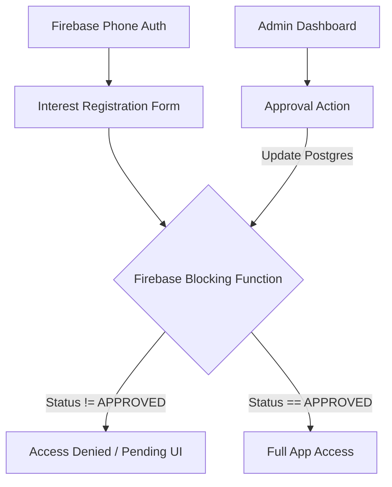

# Feature Landscape: User Onboarding & Waitlist System

**Domain:** Hyperlocal Marketplace / Invite-only Community
**Researched:** 2026-01-19
**Overall Confidence:** HIGH

## Table Stakes

Features users and admins expect for a functional waitlist and approval flow.

| Feature | Why Expected | Complexity | Notes |
|---------|--------------|------------|-------|
| **Verified Interest Form** | Primary entry point. | Low | Captures Name, Phone (Firebase Auth), and Pincode. |
| **Blocking Gate UI** | Feedback for unapproved users. | Low | Shown when Firebase Blocking Function denies token (or backend returns 403). |
| **Admin Waitlist Dashboard** | Management for user leads. | Medium | TanStack Table view in Admin panel showing PENDING users. |
| **Manual Approval Toggle** | The gatekeeping mechanism. | Low | Update `status` to `APPROVED` in Postgres via Prisma. |
| **Pincode Validation** | Data integrity. | Low | Zod regex validation for 6-digit India pincodes. |

## Differentiators

Features that improve operational efficiency or user trust.

| Feature | Value Proposition | Complexity | Notes |
|---------|-------------------|------------|-------|
| **Automated Area Approval** | Operational efficiency. | Medium | Auto-approve users if Pincode matches a "ServiceableArea" table. |
| **Approval Notifications** | User engagement. | Medium | SMS via Firebase Cloud Functions on status transition to `APPROVED`. |
| **Pincode Lookup** | User UX. | Low | Auto-fill District/State using `postalpincode.in` API. |
| **Admin Bulk Actions** | Scalability. | Low | Approve all users in a specific Pincode. |

## Anti-Features

Features to explicitly NOT build for v1.2.

| Anti-Feature | Why Avoid | What to Do Instead |
|--------------|-----------|-------------------|
| **Social Login** | Contact data quality. | Stick to Phone Auth to ensure valid contact numbers for delivery. |
| **Waitlist Leaderboard** | Unnecessary complexity. | Simple "We'll notify you" message is sufficient for MVP. |
| **Self-Service Deletion** | Compliance/Retention risks. | Admin-only deactivation for v1.2. |

## Feature Dependencies

## MVP Recommendation (v1.2)

For v1.2, prioritize:
1. **Single User Table**: Add `status` (PENDING, APPROVED, REJECTED) to existing `User` model.
2. **Blocking Function**: Implement `beforeSignIn` to check Postgres status.
3. **Interest Form**: Minimal React form with Zod validation.
4. **Admin Table**: Simple TanStack Table for status management.

## Sources
- [Firebase Auth Blocking Functions](https://firebase.google.com/docs/auth/extend-with-blocking-functions)
- [Growth Design: Onboarding Best Practices](https://www.growth.design/case-studies)
- [TanStack Table Documentation](https://tanstack.com/table/v8)
